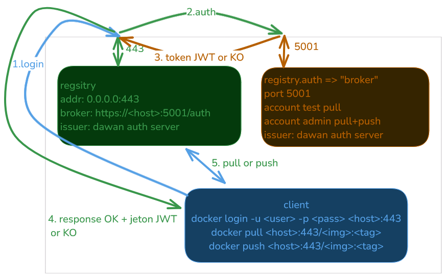

# install JWT

1. `vagrant up`
2. `vagrant ssh docker.lan`
3. docker compose
```bash
# vagrant@docker
cd /vagrant
docker compose up -d
docker login -u admin -p badmin docker.lan:443
docker pull alpine
docker tag alpine:latest docker.lan:443/my-alpine:1.0
docker push docker.lan:443/my-alpine:1.0

# account test
docker logout
docker login -u test -p 123 docker.lan:443
docker pull docker.lan:443/my-alpine:1.0
```



6. QED

---

# install credsstore with pass/gnupg2 packages on Linux

> AVANT de lancer la stack !!!

* permet de stocker les credentials du registre proprement

```bash
cd /vagrant
# see script
./generate_config.sh credsStore
```